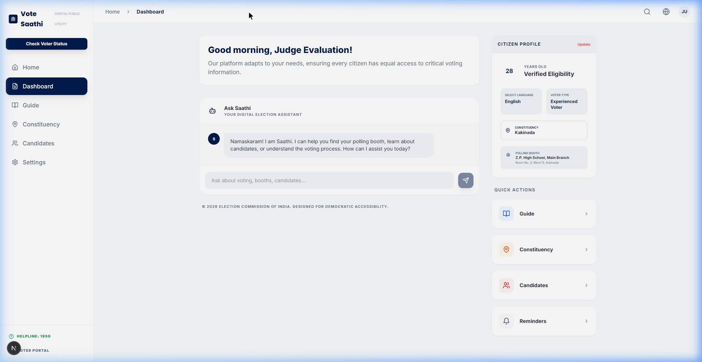
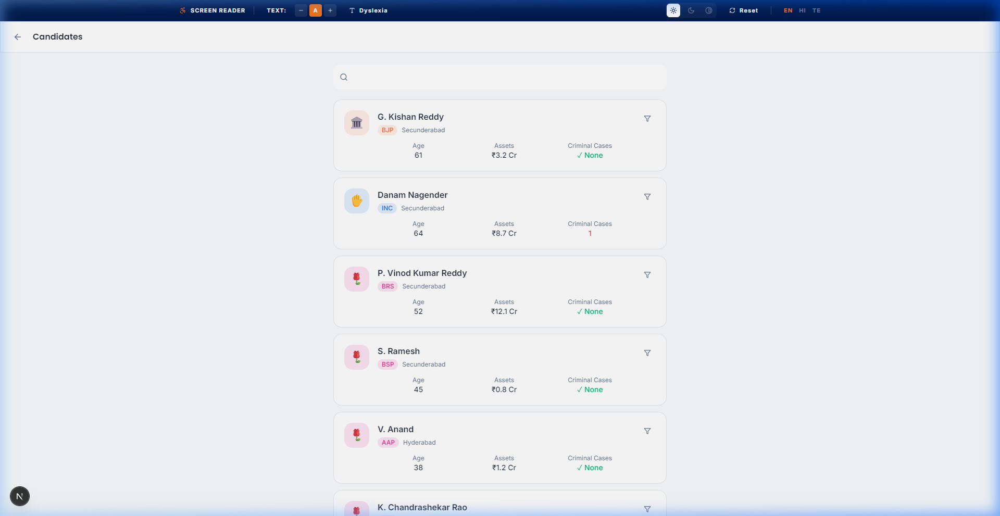
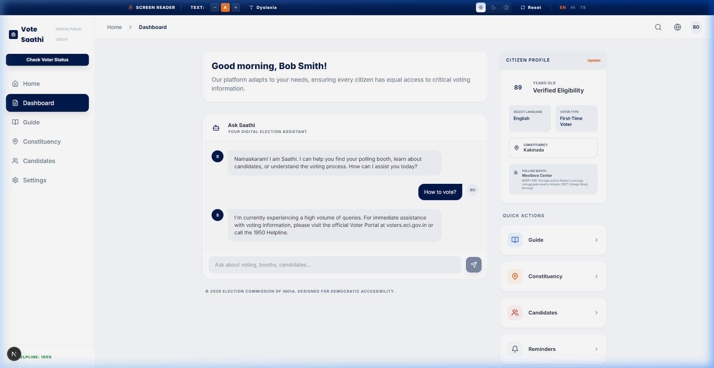
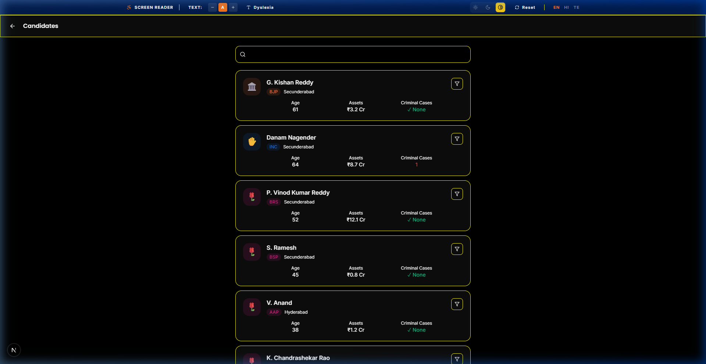

# 🗳️ VoteSaathi: Your Digital Election Companion

[](https://github.com/Yash55-max/Vote-Saathi/actions/workflows/ci.yml)

[](.github/workflows/ci.yml)

[](https://codecov.io/gh/Yash55-max/Vote-Saathi)

[](https://nextjs.org/)

[](https://fastapi.tiangolo.com/)

[](https://firebase.google.com/)

[](https://ai.google.dev/)


[](https://mapsplatform.google.com/)

[](https://tailwindcss.com/)

**VoteSaathi** is a context-aware, accessible digital public utility designed to empower Indian citizens through the democratic process. It provides personalized election guidance, multi-language AI assistance, and real-time polling booth navigation to ensure no voter is left behind.

---

## 🚀 Key Features

### 🤖 AI-Powered "Saathi" Assistant
A context-aware chatbot powered by **Google Gemini** that provides authoritative voting guidance.
*   **Multilingual Support**: Available in English, Hindi, and Telugu (with support for 6+ more regional languages).
*   **Personalized Context**: Tailors advice based on the user's age, location, and voting history (First-time vs. Experienced).

### 📍 Real-Time Constituency Mapping
Integrated with **Google Maps API** for precise geospatial navigation.
*   **Polling Booth Locator**: Automatically detects the user's constituency and maps nearby polling stations with multi-marker visualization.
*   **Live Directions**: Provides exact coordinates and addresses for verified polling booths.

### ♿ Universal Accessibility Engine
Built with inclusivity at its core for elderly and differently-abled voters.
*   **Dynamic Themes**: Support for Light, Dark, and High-Contrast modes.
*   **Accessibility Toolbar**: One-click toggles for Dyslexia-friendly fonts, Text Scaling, and Screen Reader optimization.

### 📋 Official Resource Hub
*   **Direct Links**: Access to the ECI Voter Portal, 1950 Helpline, and Grievance portals.
*   **Personalized Reminders**: Set election dates and polling day alerts.

---

## 📸 Project Gallery

### 📊 Citizen Dashboard (Demo Mode)


### 👥 Candidate Profiles


### 🤖 AI-Powered "Ask Saathi" Assistant


### ♿ Universal Accessibility Engine (High Contrast)


---


## 🛠️ Technical Stack

- **Frontend**: Next.js 15 (App Router), TypeScript, Tailwind CSS, Framer Motion, Lucide React.
- **Backend**: FastAPI (Python), Pydantic, Uvicorn.
- **AI/ML**: Google Gemini (generative-ai SDK).
- **Cloud Services**: Firebase (Auth, Firestore), Google Cloud Platform (GCP).
- **APIs**: Google Maps JavaScript API, Reverse Geocoding API, Places API.

---

## 📦 Installation & Setup

### Prerequisites
- Node.js (v18+)
- Python (v3.10+)
- Google Cloud API Key (Gemini & Maps)
- Firebase Project Credentials

### 1. Backend Setup
```bash
cd backend
python -m venv venv
source venv/bin/activate  # On Windows: venv\Scripts\activate
pip install -r requirements.txt
# Configure your .env file with API keys
python main.py
```

### 2. Frontend Setup
```bash
cd frontend
npm install
# Configure your .env.local with Firebase & Backend URL
npm run dev
```

---

## 🏛️ Digital Public Utility
VoteSaathi is designed to be a **Digital Public Infrastructure (DPI)** component, prioritizing privacy, security, and accessibility for all Indian citizens.

---

## 2.4 Data Model

### User
- `id`
- `age`
- `location`
- `language`
- `voter_status`

### Interaction
- `query`
- `response`
- `timestamp`

The backend enforces these structures through Pydantic models and frontend types.

## 2.5 Security

- Firebase security rules are defined in `firebase.rules` with per-user ownership checks.
- API keys are loaded server-side as secret values in backend settings.
- Request payloads are validated with strict schemas (`extra = forbid`, typed literals, and field bounds).

## 2.6 Performance

- Backend response caching for candidate lists and maps lookups (TTL cache).
- Optimized Firestore interaction query limits to prevent excessive reads.
- Lazy-loaded Google Maps marker UI in the constituency page to reduce initial bundle cost.

## 2.7 Testing

- Unit tests: schema/data-model validation in `backend/tests/test_schemas.py`.
- Integration tests: API endpoints and service wiring in `backend/tests/test_api.py`.
- Edge cases: empty/oversized chat input, invalid history role, and invalid coordinates.

Made with ❤️ for Indian Voters.
